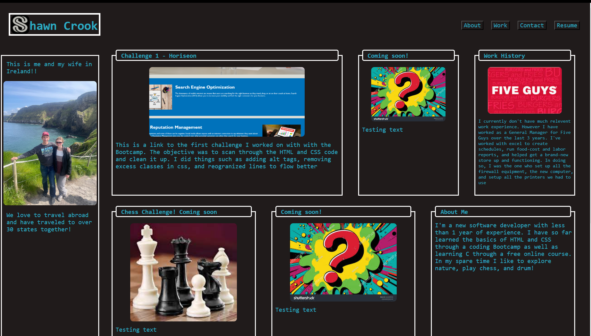
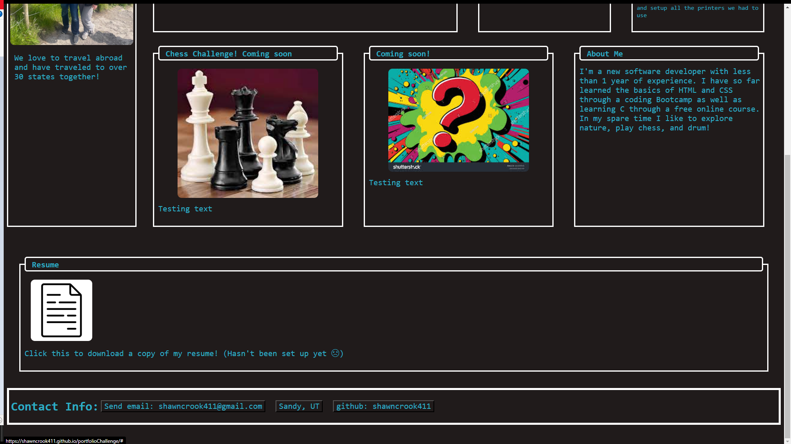
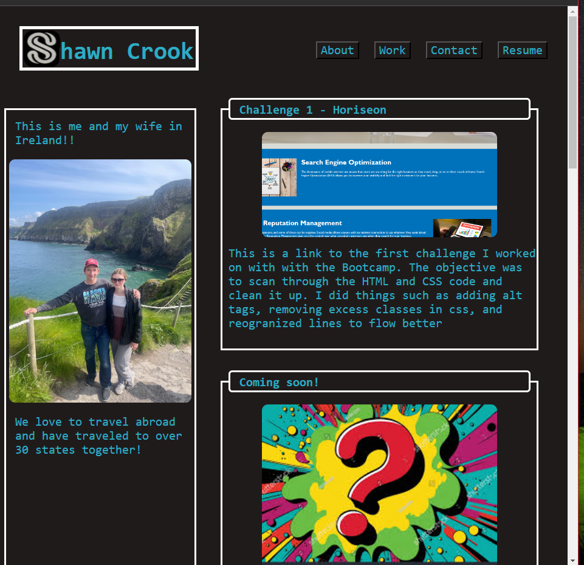

# portfolioChallenge

## Description
This is a webpage for my soon-to-be full portfolio
I created this as a test for creating html and css documents, experimenting with postioning and some of the new features we've learned in class, and to display/showcase my work in programming so far.

It was useful to see how well I could do in an actual environment and create something from scratch!

## Table of Contents
This is probably too short of a README to require a Table of Contents...

## Installation
No installation required! N/A

## Usage
Visit the following link :

https://shawncrook411.github.io/portfolioChallenge

You can see the homepage to my portfolio uploaded here
Once loaded you can use Google Tools to open up the html and see what's going on behind the scenes!

The actual repo can be found here :

https://github.com/shawncrook411/portfolioChallenge

## Screenshots
Here's a screenshot of the top half of the screen

Here's a screenshot of the bottom half of the screen

Laslty, here's a screenshot of the screen while it the window size has decreased

## Contributions
I used a CSS reset file thanks to "Eric"
CSS Reset File thanks to
   http://meyerweb.com/eric/tools/css/reset/ 
   v2.0 | 20110126
   License: none (public domain)

## Tests
Check and see if the links are working! Press any of the links in the navigation bar to see if your browser smoothly scrolls down to the tile specified

